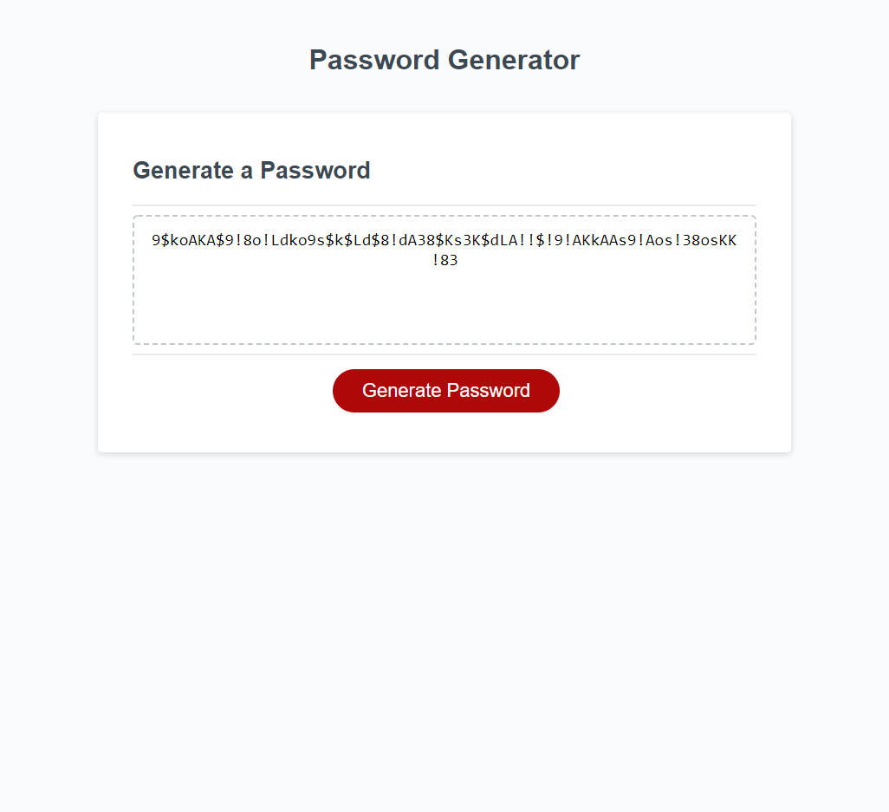

# 03-ncclymer-password-generator

    This project is intended to create a secure random password to make the process of selecting a new password
simpler for the user. We hope to add a copy button feature and to streamline the user variable input experience.

1. When a user clicks on the button a series of prompts for user input begins. Complete
2. The criteria for character selection includes: uppercase, lowercase, numbers, and special characters. Complete
3. The password output should only contain the types of characters that the user has selected. Complete
4. The generated password should be displayed in the HTML. Complete

Application and GIT repository URL's:

Site URL: https://ncclymer.github.io/03-ncclymer-password-generator/

Git Repo URL: https://github.com/ncclymer/03-ncclymer-password-generator

Screen shot: 